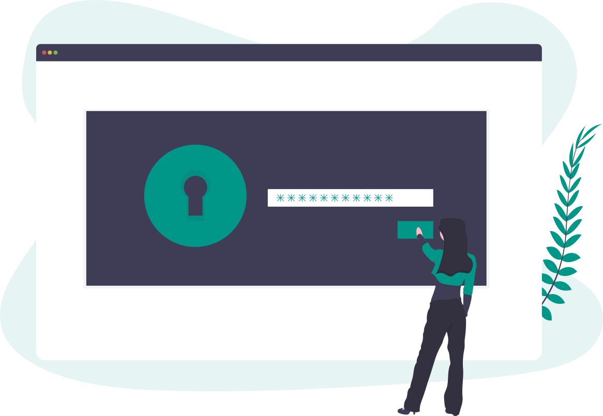

I recently upgraded my online security for work. After that process I decided to create this time-saving “cheat sheet” of tips in order to assist you in your security efforts as well.

The takeaway:

1. Use a password manager service

2. Use 2FA (two-factor authentication) — but don't use the SMS (text message) method because <a href="https://www.theregister.co.uk/2016/12/06/2fa_missed_warning/" target="blank">it's risky</a>. Instead, choose an <a href="https://authy.com/" target="blank">authenticator app</a> or a physical U2F key. 

## Background Reading on 2FA, SMS, and Physical Security Keys

While two-factor authentication (2FA) by SMS (text message) is the most familiar and common 2FA method, it’s also insecure. Here’s some background reading to bring you up to date.

* <a href="https://www.theregister.co.uk/2016/12/06/2fa_missed_warning/" target="blank">Standards body warned SMS 2FA is insecure and nobody listened</a>

* <a href="https://www.engadget.com/2018/07/24/security-keys-google-phishing/" target="blank">Mandatory keys cut successful phishing attacks on Google to zero</a>
 
* <a href="https://www.wired.com/story/reddit-hacked-thanks-to-woefully-insecure-two-factor-setup/" target="blank">Reddit Got Hacked Thanks to Woefully Insecure Two Factor SMS</a>

* <a href="https://www.makeuseof.com/tag/two-factor-authentication-sms-apps/" target="blank">It's Time to Stop Using SMS and 2FA Apps for 2-Factor Authentication</a>

> Two-factor authentication via text message is insecure

## How Much Does It Cost to Upgrade My Security?

Expect to spend anywhere from $8 - $112. At that low cost there’s no reason not to start upgrading today.

If you go with a free password manager and two <a href="https://amzn.to/2DD7mEp" target="blank">$12.95 security keys</a> (I recommend you buy 2 keys, one for a backup) you're good for $26.

If you need a password manager with teams access then you’ll pay for your service. 
* 1Password.com charges $47.88 for a team account
* Dashlane Premium is $59.99 and comes with a VPN. 

Extending physical key protection to your laptop login can be done with a <a href="https://amzn.to/2DzdNIj" target="blank">Yubikey 5</a> which sells for $45.  

Google is one of hundreds of online services you can secure with a physical security key.

> Even if someone steals your logins they won’t be able to access accounts protected by your physical key.

## What's a U2F Key?

A U2F is a physical security key that plugs into the USB port on your computer. It contains an encrypted password (called a “key”), that, when matched with a different key on the software service you’re using, unlocks your account. 

## Setting Up a U2F Key: Easy or Hard?

For each online service that you plan to use the key with, you’ll need to complete a “setup” by navigating to your account security settings. Setup is intuitive: you’ll receive prompts on your screen to insert the physical key and then, when the embedded LED on it starts flashing, to tap it. That’s it. 

During this process your U2F device generates a set of cryptographic keys for that service. It does the same thing for each online service. 

Once you set up your key with a participating online service, no none can access your account without your physical key. This provides powerful protection against phishing among other remote attacks.

SaaS providers that allow you to use physical U2F keys include: 

* Google

* Dropbox

* DocuSign

* HackerOne

* Amazon Web Services (AWS) Identity Management Services

* Binance and other cryptocurrency services

* Developer platforms like Github, GitLab, Bitbucket and Codeship

* Twitter, Facebook, Reddit, YouTube and Instagram

* Sales and marketing platforms like Salesforce and Mailchimp

CMSs (content management systems) like WordPress, Drupal, Joomla, Miva Merchant, and Squarespace.

## What Does U2F Stand For?

U2F stands for Universal Second Factor. It’s a standard. Read about the <a href="https://en.wikipedia.org/wiki/Universal_2nd_Factor" target="blank">>history and development of it here</a>. 

 
Would you recognize it if you were under a phishing attack? Take this <a href="https://phishingquiz.withgoogle.com/" target="blank">free online quiz</a> from Google

## My Security Set Up

Before I share tips, here’s my security setup. 

* Password Manager: Dashlane Premium

* Authenticator App: Authy

* U2F Keys (two, one for backup): <a href="https://amzn.to/2DzdNIj" target="blank">Yubikey 5</a> and <a href="https://amzn.to/2DD7mEp" target="blank">HyperFIDO Mini</a>

## Tips For the New U2F Key User

The first key I purchased was the <a href="https://amzn.to/2DD7mEp" target="blank">HyperFIDO Mini</a>. This key is sufficient to cover most U2F needs. 

To set it up, you simply navigate to an online service that offers U2F as 2FA (two-factor authentication). Go to your account security settings. Follow the instructions. 

How does it work after it’s set up? Let’s say you’ve paired your HyperFIDO Mini with your a website account. You have also set up a password manager. 

When you navigate to the website account, your password manager will automatically fill in your password. The green light on your key will begin flashing. You need to press the key’s button in order to successfully log in.

The HyperFIDO Mini comes with a thin tether and tiny metal ring. I would not advise putting this on your keychain. The tether will surely not hold up, and you’ll lose your key.

If being ably to carry a U2F key on your keychain is important to you, I recommend that you choose a different model .

Otherwise I recommend the HyperFIDO Mini as an easy-to-use, low-cost security solution well worth the price. 

### Do Password Managers Only Work With Yubikey?

Short answer: No. Any U2F key will work with password managers that have the service enabled. 

It’s easy to get this wrong. The password manager I chose had stated online that they’re compatible specifically with the Yubikey 5. With no other online information available about other keys they were compatible with, I mistakenly assumed I needed a Yubikey 5 if I wanted to use a U2F key with the password manager. 

But it turned out the HyperFIDO Mini was all that I needed. 

### Using Yubikey 5 For MacOS Login

However, the <a href="https://amzn.to/2DzdNIj" target="blank">Yubikey 5</a> gives you some advanced options, which are useful (and geared towards geeks). 

One of those options is to use it for login to your MacOs. Once set up, no one can log in to your Mac unless they have your password and your physical security key.

To do enable this function on your Yubikey 5 you’ll need to download the Yubikey Manager software. Follow the instructions to configure settings on the software. Then you’ll be asked to input some commands into your Mac terminal. 

I found the process easy and straightforward. But if you’ve never used a terminal before it may seem intimidating. 

Once you have this set up you’ll need to insert your security key whenever you log into your computer. A green light will flash, cueing you to lightly run your finger across the “Y” on the key. This generates an electrical charge that triggers authentication via a capacitive touch sensor.

There are 2 “slots” (or containers) that you can program on the Yubikey. You’ll use Slot 2 to configure MacOS access. Once you’ve completed configuration, you will touch the gold circle on the key to access login to your laptop. Note: the Yubikey accepts 3 types of touch: short touch, long touch, and tap. Each triggers a different function.

The <a href="https://amzn.to/2DzdNIj" target="blank">Yubikey 5</a> offers NFC (near field communication) capability, so you can hold it close to a mobile device in order to unlock accounts. 

If you want to go with the industry leader, but don’t know which Yubikey is right for you, try this handy quiz. It will help you select the right key.

If you don’t need or want NFC, you’re not looking for advanced capabilities, and you want to keep things as simple and cheap as possible, I’d suggest going with the HyperFIDO Mini. 

## Choosing a Yubikey

The first thing you’ll want to be clear on is what type of USB port does your laptop or PC have?

### USB A or USB C?

You’ll have either USB A or USB C. 

USB A has a square receptacle. USB C, a newer design, has a rounded receptacle. Here’s a depiction of each so you can easily determine which one you have. 

If there’s a physical key you’re set on but it doesn’t match your port, you can buy a USB adapter.

#### Yubikey Models For USB Type A Port

The Yubikey Nano is used by Facebook. It’s designed to stay in your port. (Geeks interested in learning how Facebook uses the Nano can find out more here.)

If you’ve got a Type A USB port, here are some Yubikey options for you. 

##### <a href="https://amzn.to/2XYZVPF" target="blank">Yubikey Nano</a>

This is the model used internally by Facebook. It’s a tiny key (the size of a dime) you can leave in your USB slot. Just tap it to log in. Available on Amazon for $50.

##### <a href="https://amzn.to/2DGbmno" target="blank">Yubikey 5 NFC</a>

This is the key described above. It has the most options and features including the ability to tap it against an Android or iOS device for authentication. This is designed to go on your key chain but you can leave it in your port if you wish. Currently priced at $45 on Amazon.

##### <a href="https://amzn.to/2IOzh8n" target="blank">Yubico Security Key (blue)</a>

This is the cheapest model. At $20, this bright blue key is designed to be carried on a key chain and provides everything you need to get going with physical key security. 

Note: It does not provide the option, like the Yubikey 5, to unlock your MacOS.

If you want NFC touch authentication for your mobile devices then choose the $27 version called the <a href="https://amzn.to/2Y1z59F" target="blank">Yubico Security Key NFC</a>. 

The  Yubikey 5 (black)  and  Yubico Security Key NFC (blue)  both provide NFC touch authentication for mobile devices.
The Yubikey 5 (black) and Yubico Security Key NFC (blue) both provide NFC touch authentication for mobile devices.

Yubikey Models For USB Type C Port

* Yubikey Nano (USB C)
* Yubikey 5 (USB C)

This is similar to the Yubikey 5 described above, except that it doesn’t have NFC capability.

### Get a Backup Key
You should get a backup key. It’ll make it easier to gain access to your accounts should you lose your main key.

### Authenticator Apps

Authenticator apps generate numeric tokens to use for 2FA (two-factor authorization). 

They’re considered more secure than SMS (text message) tokens. 

There are a number of authenticator apps you can use on your smartphone like Google Authenticator.

If you want one that also works a desktop, try Authy. It’s free.

Each Authy token lasts for 30 seconds, at which point another is generated.

Some online services will require that you sign up for 2FA via SMS and/or authenticator app before you can sign up with your physical key. This is so that you’ll have multiple ways to retrieve access if you lose your key.

## Password Managers
You’ll need to vet and choose a password manager. If you’re using this in a business context then you may need a “teams” option where select passwords can be shard. 

Some of the best known password managers are: 

* Dashlane 

* 1Password

* LastPass

### Hardening Security With Bug Bounties
1Password and LastPass participate in the BugCrowd bug bounty program and Dashlane participates in the HackerOne bug bounty program. 

Bug bounty programs invite ‘white-hat’ hackers to attempt to breach the assets of participating corporations in exchange for negotiated cash rewards. This improves security and fosters transparency.

## Quick Tips
* Physical keys don’t work with all browsers: They currently have support in Chrome, Opera, and Mozilla.

* Most banks and financial institutions appear to be behind the times: they typically just use 2FA via SMS. But some 2FA is better than none.

* The physical key is about protecting your online accounts from remote attacks. So, if you want, you can leave your key in your USB slot. 

* If you previously saved your passwords in your browser, be sure to pick a password manager that allows for bulk import. Also realize that after you start using your password manager, you’ll want to look up the instructions for turning off your browser’s auto sign-in. If you don’t you’re likely to run into situations where both services attempt to fill in your password. 

* Beef up your passwords: When you set up your password manager, take the opportunity to beef up your passwords. According to security experts a 6-character password can be cracked in less than a second.

## Summary

I hope you found these tips helpful. Upgrading your security can be done quickly and cheaply. 

While no solution offers perfect or guaranteed security, making yourself a hard target is wise.

### Recommended Reading

<a href="https://www.yubico.com/2016/02/use-of-fido-u2f-security-keys-focus-of-2-year-google-study/" target="blank">Google publishes two-year study on use of FIDO U2F Security Keys</a>
