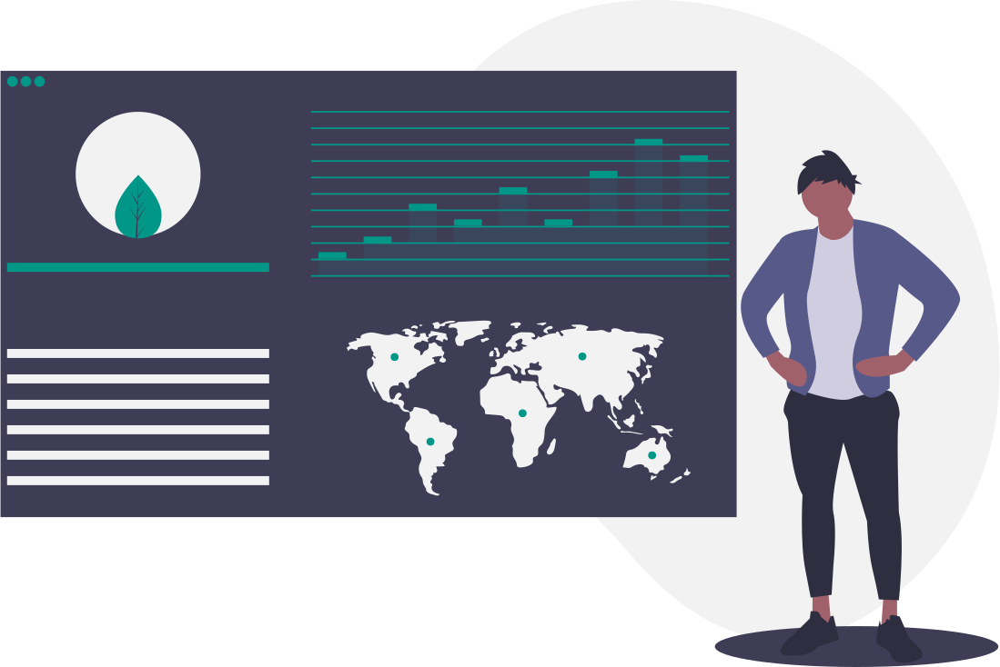

The Digital Measurement and Marketing Model (DMMM) is a tool and 5-step process to ensure your marketing and communications priorities are rooted in your business objectives.

It provides a brainstorming and planning framework for (1) achieving clarity around business objectives and (2) achieving alignment between your business objectives; the digital strategies for achieving those objectives; and related KPIs, targets, and segments.

If leadership has not clarified top-line objectives prior to working through the DMMM, then the process itself can be used to surface and rectify that. Likewise, if tactical Shiny Objects are masquerading as digital strategies, then that will also become apparent.

The Digital Measurement and Marketing Model was created by Google executive Avinash Kaushik, a Fortune 500 consultant and global thought leader in marketing. Kaushik's digital models are brilliant in their simplicity and designed to optimize impact.

This model is "foundational for making sound, actionable recommendations based on data," explains Kaushik. "We’ll know what success and failure look like. We’ll know where to start and what to focus on."

With good reason he recommends that the DMMM be signed so that "all parties are clear on what everyone is supposed to be solving for."

 
The root cause of failure in most digital marketing campaigns is not the lack of creativity in the banner ad or TV spot or the sexiness of the website. It is not even (often) the people involved. It is quite simply the <strong>lack of structured thinking</strong> about what the real purpose of the campaign is and a lack of an objective set of measures with which to identify success or failure.

 <em>— Avinash Kaushik</em>  

Those who are familiar with the <a href="https://jester.nl/en/ogsm-model/" target="blank">OGSM strategic planning process</a> will see this model as related. (<a href="https://en.wikipedia.org/wiki/OGSM" target="blank">OGSM</a> stands for Objectives, Goals, Strategies, and Measures.) 

## Quick View

<mark class="highlight">Business Objectives (3-5) > Goals > KPIs > Targets > Segments</mark>

You'll start by identifying your topline business objectives. Choose 3 to 5. 

Then determine goals for each objective. (Kaushik uses "goals" to mean digital strategies for achieving your objectives.) The right KPIs then need to be chosen for those digital strategies. Then come targets and segments.

Mock up a grid similar to the one below for your brainstorming discussions. This stacked layout underscores the straight line that you need to form from business objective all the way to targets and segments. 

Keep all text brief and concise: you want to wind up with the big picture on one page. 

Now, let's look at Kaushik's steps.

## Step 1: Identify Your Business Objectives

Who: Senior executives, marketing lead

What: Aim for 3 - 5 top-line objectives.

Focus on the "why": Why does your enterprise exist? It's easy to get distracted in this phase by the myriad "what" that your organization is involved in (events, video series, ad campaigns, and so on). Set aside the "what" for now.  As Kaushik points out, thinking this through may be harder than you anticipated.

Tip: use Kaushik's acronym "D.U.M.B.": "Doable, Understandable, Manageable, Beneficial. Real world, clear, executable, and those that deliver value to the company (short-term and long)." 

Avoid vague objectives as well as extreme objectives. Ask: "What evidence is there that this is achievable?"

Tip: Avoid letting emotion and wishful thinking guide the selection of these objectives. Don't foster a "rah-rah" atmosphere when working on these. Ground your decisions in reality.

Examples of top line business objectives:

* Create awareness
* Generate leads
* Highlight events
* Grow community
* Increase customer satisfaction
* Increase customer retention
* Increase understanding of our ideas (suitable for some nonprofits)
* Broad financial objectives like: increase sales, grow revenue
* Improve online efficiencies
* Innovation-based objectives
* Development of a new technology or user experience
 

## Step 2: Identify goals

Here "goals" means digital strategies you'll use to accomplish the objectives. 

Now that you've attainted clarity on your objectives you can ask the critical question, "What problems do we need to solve in order to achieve our objectives?" (Note: a "problem" can be an opportunity that you want to take advantage of.) 

Let's assume that you have set as a website objective to "Generate leads." Your "goals" then could include: 

* Capture leads (via email signups, free ebook downloads.) 
* Provide info/resources to target audience
* These are two examples from Kaushik himself. 

In the main DMMM document it's best to express these goals in the simplest way—use a short phrase. That will help you develop and keep the big picture in mind. 

I like to keep, on a separate document, a more fleshed out description of the digital strategy(ies) for each objective. Strive to keep this expanded description short as well—no longer than a paragraph. 

You might have something like this as your expanded description for the "Capture leads" goal above: 

* Increase conversion points. (Increase basic micro- and macro-conversion points on the website, e.g. email sign-up, free book/white paper download, survey, and online event sign-up.)
* Develop compelling content to associate with each conversion point.
* Turn anonymous site visitors into known contacts and nurture those leads. (Implement multi-channel marketing automation to capture and engage leads with automated online and offline messaging, then do lead scoring, and sync data to CRM or analytics tool.)

Let's assume one of your topline objectives is to "Create awareness." Then your "goals" could include: 

* Reinforce advertising. (Based on a Kaushik example). 

The fleshed-out paragraph for "Create Awareness" might include: 

* Create clear purpose for Facebook page
* Plan/create compelling brand awareness content for this page.
* Build strong target audiences in Facebook, use Facebook Pixel, launch effective advertising following the STDC framework (making sure creative, content, and channel is suited to audience intent phase). 
* Nurture new brand awareness contacts on Facebook and by getting them to interact with Owned platform where they can onboard into a compelling user journey via multi-channel marketing automation.

<em>Note: the DMMM can be used to account for an entire enterprise, or it can be used to plan for an individual campaign or website.</em>

## Step 3: Identify KPIs

KPIs (Key Performance Indicators) are metrics that show you how you're doing as against your objectives. You'll be able to measure progress toward the goal and in your analytics reports, make recommendations for course corrections.

"For each goal, sweat, and find the most hyper-relevant KPI," advises Kaushik. 

### Avoid Vanity Metrics

When selecting KPIs, avoid the swamp of vanity metrics — such as engagement, total page views, total video views, Facebook fans, Twitter followers, number of emails sent, size of email list, impressions, reach, number of press reports, and so on. 

Vanity metrics are largely meaningless but often attract the inexperienced because they offer large numbers, or are easy to "goose" into the millions.

It's possible to have <a href="https://hbr.org/2013/03/know-the-difference-between-yo" target="blank">millions of video views</a> and to fail at customer acquisition, sales, and revenue generation. There are plenty of free resources to get up to speed on digital analytics. (See the Related Resources section at the end of this post.)

Please note that some metrics may make sense for <a href="/see-think-do-model">particular projects in specific channels</a>, and yet may not qualify as KPIs because they are untethered to your venture's ultimate raison d'être.

Focus instead on metrics that reveal whether or not you're achieving your core business objectives. 

> All data in aggregate is crap. 
<small>— Avinash Kaushik</small>

Here are some of Kaushik's sample objectives, goals and related KPIs: 

* Create awareness | Reinforce offline/online advertising | Branded traffic
* Generate leads | Capture leads (e-newsletter sign-ups) | Conversions (e-newsletter)
* Generate leads | Provide free ebook resource | # downloads

Let's add some more examples: 

* Generate leads | Nurture leads via automation | % of completed user journeys (multi-channel drip campaigns)
* Highlight events | Engage community via in-person events | % increase in registrations, post-event Net Promoter Score
* Grow revenue (non-profit example) | Improve communication with donors |  donor retention, 'basket' size, total membership, 'revival' of lapsed donors, total donations.

With digital strategies and KPIs completed you can start creating to-do lists and KPIs can be monitored. These KPIs will give you insight into: 

* Based on voice of customer feedback, what needs to be improved? 
* What areas of marketing are having challenges?
* What areas of the site(s) are having challenges?
* What new testing should be done (A/B, multivariate, user, other)?
* What should be amplified?
* What should be dampened?
 

## Step 4: Set Targets

Definition: "Targets are numerical values you’ve pre-determined as indicators of success or failure." You need targets in order to plan and assess appropriately. Your targets will enable everyone to see how the organization is doing.

You can derive your targets from historical performance or from performance in a related area. If you don't have a clue where to start, just pick a reasonable number. Once you start collecting data, you'll be able to set more meaningful targets.

They can be expressed in various ways, including: 

* As a percentage or percentage increase or decrease (e.g. 25% click-through-rate; 10% increase in conversions 20% decrease in cart abandonment rate.
* As a number (5,000 branded visits per month)
 

## Step 5: Identify Segments
 
In this step you'll identify valuable segments for analysis. Here Kaushik's definition of a segment will be very useful to you: "A group of people, their sources, onsite behavior, and outcomes."

Here it's critical to get clarity, with leadership, on what your highest value segments will be. "Identify the sources of traffic, types of people desirable, their attributes, their behavior, business outcomes that they care about the most. And what customers to the site might want to accomplish. Balance for the company and the customers," advises Kaushik. 

Segments can be: 

* Traffic sources
* Repeat or loyal visitors
* Highly engaged visitors (measured by a per-page average per visit + a time scope)
* Geography-based (a region, state, or country you are targeting, e.g. for an event or sale) 
* Converted visits
* Site tools used

### Related Resources

#### <a href="http://www.journalofadvertisingresearch.com/content/56/2/126" target="blank">Resisting the Siren Call of Popular Digital Measures: Facebook Research Shows No Link Between Trendy Online Metrics and Ad Effectiveness</a>

Popular metrics like growth of a fanbase are found to have no impact on brand performance. “The allure of measurable and traceable ‘shiny’ metrics—such as social-media users’ ‘Likes,’ ‘Shares,’ message posts, and ‘clicks’—has led marketers to endless, often beautifully crafted, intricate reports on the irrelevant.” This research paper exhorts executives to become "data-literate." — Brad Smallwood, VP of Marketing Science for Facebook

#### <a href="http://newsfeed.cz/wp-content/uploads/Engagement-on-Facebook-When-it-Matters_3.10.14.pdf" target="blank">Engagement on Facebook: When it Matters</a> 
One key takeaway: Ad engagement doesn't lead to sales. (Facebook for Business study)

#### <a href="https://www.kaushik.net/avinash/web-metrics-super-lame-super-awesome/" target="blank">Your Web Metrics: Super Lame or Super Awesome?</a>
Hint: Total pageviews, video views, Facebook fans, Twitter followers, are <em>lame</em>. (By Google Executive Avinash Kaushik)

#### <a href="https://www.thinkwithgoogle.com/intl/en-ae/article/kpis-an-essential-framework/" target="blank">KPIs: An Essential Framework</a> 
This approach uses the See-Think-Do-Care framework. (By Johan Eriksson, Industry Leader, Branding Northern Europe, Google.)

#### <a href="https://hbr.org/2013/03/know-the-difference-between-yo" target="blank">Know the Difference Between Your Data and Your Metrics</a>
A non-profit finds that high video views did not lead to business success. (<em>Harvard Business Review</em>)

#### <a href="https://blog.kissmetrics.com/facebook-likes-data-driven-answer/" target="blank">Do You Really Need More Facebook Likes?</a> 
Facebook likes are not correlated with more business or more engagement. (Neil Patel, Kissmetrics)

 

 
<a href="https://www.flickr.com/photos/50353506@N05/6026476967" target="blank">"Avinash Kaushik"</a> by <a href="https://www.flickr.com/photos/50353506@N05" target="blank">Thos003</a> is licensed under <a href="https://creativecommons.org/licenses/by/2.0/?ref=ccsearch&atype=html" style="margin-right: 5px;" target="blank">CC BY 2.0</a>

