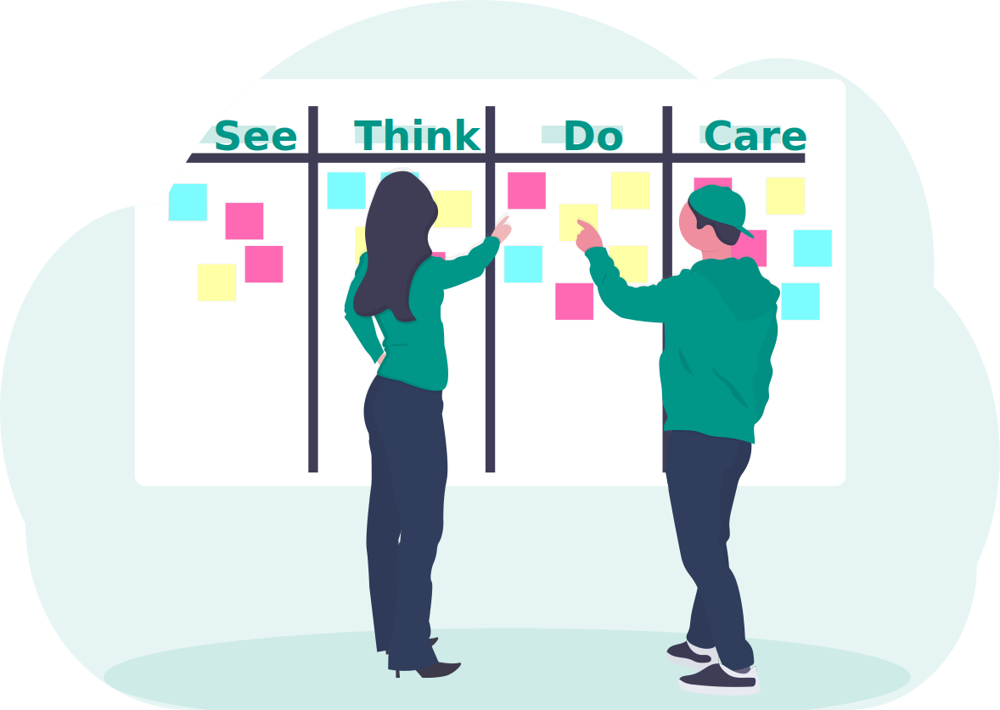

The See - Think - Do - Care (STDC) Model is a simple yet powerful business framework that will transform the way you communicate with and market to your target audience.

At the core of STDC are two principles:

1. There are 4 different audience intent clusters.
2. You need to <em>solve</em> for all four in order to be successful.

The 4 audience intent clusters are <em>consideration stages</em>.

Each intent cluster has a specific scope and definition.

<table>
  <tr>
    <th>Audience intent cluster</th>
    <th>Who belongs in the cluster?</th>
    <th>Their intent / mindset</th>
  </tr>
  <tr>
    <td>See</td>
    <td>Largest&nbsp; addressable&nbsp;  qualified audience (LAQA)</td>
    <td>Discover your brand for the first time.</td>
  </tr>
  <tr>
    <td>Think</td>
    <td>LAQA with mild commercial intent</td>
    <td>Think about your brand's offerings</td>
  </tr>
  <tr>
    <td>Do</td>
    <td>LAQA that's ready to transact</td>
    <td>Willing to or in process of purchasing from you</td>
  </tr>
  <tr>
    <td>Care</td>
    <td>Repeat customers</td>
    <td>Affinity for your brand</td>
  </tr>
</table>

 
Viewing the right-hand column you'll notice that there's a flow that resembles the cultivation of relationships. Someone has to become aware (See) that you exist before they consider what you offer in the way of friendship or romance. And people need to get to know you (Think) before they get serious and commit (Do) to the relationship. 

 

  
What do we mean by "solve for"?
 
   <ul class="highlight2">
     <li>To get optimal results, you need to create an effective strategy for engaging each intent cluster. </li>
 <li>For each stage, you'll create content (and creative) (a) suited to their <em>level of interest</em> and (b) perceived by them as valuable or attractive.
</li>
 <li>And, for each cluster, you need to "deliver" that content via channels that are effective for reaching <em>that particular stage</em>. As you'll soon learn, <em>not all channels work equally well for each intent stage</em>. </li>
    <li>Lastly, you need to create a measurement strategy for each cluster so you can measure your success and adjust where needed.</li>
 </ul>

 

 
What's a "channel"?
 
    
A channel is any mode of communication, offline or online. Channels include print, digital, an in-person modes of communication. They traditional/mass market channels like radio, TV, and billboards. Digital channels include your website, social media, email, third-party marketplaces like Amazon, mobile apps, app stores, business directories, Google My Business pages, <a href="https://audiotonic.us" target="blank">Alexa skills</a>, text messaging, SEO/search engine results, and advertising.

 
Advertising channels include display ads, affiliate marketing, and PPC (pay-per-click) ads for search engines or social media.

 
Sales or marketing phone calls with prospects or donors could also be considered a channel.

 
In this article, we'll be focusing on commonly used digital channels.

 
 

  
What do we mean by “intent clusters” or "consideration stages"? 
 
 

You can think of the intent stages as <em>relationship</em> stages. They signal purpose and indicate mindset and level of interest in your brand. 

 <ul>
     <li>Some people have never heard of you. You want them to “See” and know your brand for the first time.</li>
  <li>A subset of Seers will go on to <em>Think</em> about your brand’s offerings. (e.g. They may visit your website, sign up for a webinar, download a free book, research the competition, read customer reviews, sign up for an email newsletter, etc.)</li>
  <li>A subset of these Thinkers will become <em>Doers</em> and transact with you. </li>
 <li>A subset of these Doers will begin to Care about your brand: they’ll have an affinity for it, as characterized by repeat transactions.</li></ul>
 

To grow your business you have to craft effective communication strategies for each stage. 

In short, you can’t communicate the same way with each cluster and expect to reach your full potential for success.

 

## See Your Brand From Your Prospect's Perspective

The See-Think-Do-Care model is the brainchild of Avinash Kaushik, a Google executive, Fortune 500 consultant, and global thought leader in marketing and analytics. 

The audience intent clusters were named See, Think, Do, and Care to encourage you to view your planning through the lens of the customer's perspective. 

This is a subtle yet profound difference (not the only difference) with other models. 

It leads you to ask: 

* What is it like for a consumer to see your brand for the first time? What do you want that experience to be like? 
* What thing of value (content) can you provide to them that will encourage them to think about your brand's offerings? 
* What do they need to move from the Think stage to the Do Stage? 
* When they take a Do action, what experience can you provide that would "wow" them?

> "The goal is to optimize See and Think in order to maximize Do."  
<small>— Avinash Kaushik</small>

## Think Differently

This STDC framework was created to teach you <em>how to think</em> about digital so you can make better decisions and get better results. 

I'm using "digital" as shorthand for the platforms (including your website and social media), tactics, and strategies available to you.

Remember: each consideration stage shares an <em>intent</em> and has a <em>different level of interest</em> in your brand. 

To win people over in each stage (See - Think - Do - Care), you need a plan to:

1. Provide content that matches their intent, interest level, and that they find valuable. (Valuable can include entertaining, surprising, or useful.)
2. Deliver it via a channel that is effective for reaching that cluster. 

You'll also want to brainstorm what type of content will give your audience a reason to <em>shift</em> from one stage to the next.

Each cluster should be assigned different goals and metrics.

The framework will guide you to shape your content and marketing to meet the needs of each cluster and attain appropriate outcomes for each. 

## Getting Started: Define Your Audience

When defining your LAQA (largest addressable qualified audience) ask "What behaviors or interests qualify them to be in our target audience?"

Here's an example for a personal training business. In this example, we're targeting only people who live near South Station in Boston.

<table>
  <tr>
    <th>Audience intent cluster</th>
    <th>Who belongs in the cluster?</th>
    <th>Consulting case example</th>
  </tr>
  <tr>
    <td>See</td>
    <td>Largest&nbsp;addressable&nbsp;qualified audience (LAQA)</td>
    <td>Health-conscious people in our district who lead active lifestyles</td>
  </tr>
  <tr>
    <td>Think</td>
    <td>LAQA with mild commercial intent</td>
    <td>Health-conscious people in our district who lead active lifestyles <em>and are considering personal trainer options</em></td>
  </tr>
  <tr>
    <td>Do</td>
    <td>LAQA that's ready to transact</td>
    <td>Health-conscious people in our district who lead active lifestyles, are considering personal trainer options, <em>and are at the later stages of a purchasing decision</em> </td>
  </tr>
  <tr>
    <td>Care</td>
    <td>Repeat customers</td>
    <td>Current customers who've signed up for more than one training block</td>
  </tr>
</table>

## Matching Channels to the Audience Intent Cluster

Now let's look at digital channels.  

As I mentioned earlier, not all channels are effective for reaching each the 4 audience intent clusters. Including this fact in your planning is part of genius of Kaushik's framework. 

The diagrams below highlight which channels work well with the 4 intent clusters. 

<aside>
Note: the point of matching channels to intent clusters is not to encourage you to be active on all possible channels. The point is to be sure you're using your channels <em>in an optimal way</em>.
 </aside>

Let's start with SEO and social media. 

* You can see that SEO is an effective channel for reaching people in the See, Think, and Do stages, and a bit for the Care stage.
* Social media, on the other hand, is seen in this diagram as chiefly good for See stage messaging, and just a tad for Think.

### YouTube's Unique Strength

Before we go further, let's take a closer look at YouTube. This platform is different from other social media channels in that it's excellent for Think stage content.

YouTube is also good for a bit of See and a bit of Do. 

Let's adjust the diagram to incorporate this information:

* Which cluster(s) is your current YouTube content targeting? 
* What sort of YouTube content could you create to engage your Think cluster?

### Facebook: Organic Posting or Ads?

Facebook is great for reaching new people in your target audience who are not aware of your brand. Like our other social media platforms (excluding YouTube), it's also good for the beginning stages of Think. 

But there's something important that businesses and nonprofits need to understand about Facebook that may change the way you use this social platform.

Over the years Facebook has throttled back the reach of "organic posts" made on business and organizational Pages. (An "organic" post is a post that doesn't have any advertising money behind it.) 

It's been previously estimated that only 2% to 6% of the people who've liked (become a "fan") of your Page will ever see your posts in their newsfeed. This downward trend has been going on for years. 

This is why I advise businesses to de-emphasize organic posting. It's largely a crapshoot and a waste of time. 

Instead, focus on Facebook ads. Using Facebook's ad platform, you can <a href="https://www.facebook.com/business/learn" target="blank">target your ads</a> specifically to your LAQA. You can do this by building an ad audience that matches the same interests, demographics, and geographic location as your LAQA. That presents a tremendous opportunity for growing your See cluster. 

Let's adjust the diagram accordingly: 

You'll see that Facebook is also good for providing value to some of your Care customers. For nonprofits: if a significant number of your top donors are active on Facebook, I recommend engaging directly with <em>their posts</em> as a means of staying top-of-mind.

Now let's stop and consider how you might use this information about Facebook. 

* You might cut way back on organic posting and focus instead on ads
* The content of your "awareness" ads would be shaped to the See audience: it would be brief and designed to get your brand on their radar.
* You would also create ads to generate leads. These would be targeted to Think audience. (Those ads can lead to a landing page or back to your website where they might be offered a freemium like a free downloadable e-book.)
* You would avoid using Facebook ads to target the Do cluster. (So you wouldn't use "buy now" messaging.)

Here's a story that a client shared with me. It illustrates how the See - Think - Do model can help you avoid errors and create more effective commmunications for your brand.

 
"Facebook ads don't work!"
 

A sole proprietor ran a single Facebook ad for $50 to sell something that costs over $2,000. But no one bites on the ad. The business owner concludes “Facebook ads don’t work!” 

Why didn’t anyone bite on the ad? 

 

Facebook is generally an excellent channel for the “See” stage (increasing awareness of your brand). 

<ul>
 <li><strong>	&#128161;</strong> The See cluster has <mark class="highlight"><em>no commercial intent</em></mark>.</li>
</ul>
 

Facebook is generally also useful for a tad of “Think” stage communications as well.

 
<ul>
 <li>The Think cluster has only <em>mild</em> commercial intent — <em>at the most</em>. (Many in the Think cluster have <em>no</em> commercial intent. Remember, this stage is defined only by <em>an intent to consider</em> — to think about — what your business or organization does, offers.)</li></ul>
 
 

Typically, Facebook doesn't work well for the “Do” stage of buying. 

 
<ul>
<li>The Do cluster has commercial intent. (They may be comparing products or services or deciding between organizations competing for their donor dollars.)</li>
</ul>
  

So the proprietor ran a Do message on a See channel. When the ad didn't deliver, the proprietor "judged a fish by its ability to climb a tree" (a phrase Avinash Kaushik likes to use).

The client needed to shift his expectations of Facebook, and use the tool differently. By using Facebook ads to target his LAQA with See content, the client began to grow awareness of his brand effectively.

 

### Email Marketing

As you probably guessed, email marketing is an effective channel for every cluster except the See cluster. 

### Multi-Channel Marketing Automation

Here I'd like to add in multi-channel marketing automation. That's a mouthful. What does that term mean? 

Multi-channel marketing automation software enables you to create messages in a variety of channels from one dashboard. My favorite software for this is Autopilot. It enables you to create "heads-up" messages (small, unobtrusive pop-ups on your website), email, SMS (text messages), and print postcards. 

### What About Advertising? 

Now let's fold advertising into the mix. 

In the diagram below you'll see:

* Display advertising
* Retargeting advertising
* PPC (pay-per-click) advertising (search engine ads) 
* Affiliate marketing

<small>*AFF = affiliate advertising</small>

Note: this channel information is drawn largely from Kaushik's consulting practice, with some slight modifications by me.

It represents a distillation of experience and wisdom, in the same way that a proverb is a distillation of life wisdom. A proverb is typically true (e.g. "The early bird catches the worm"), although there are exceptions. Test and confirm which channels are optimal for your business, then modify the diagram if need be.

### What You Can Take Away From the Channel Diagram

Here are a few sample takeaways and questions you can draw from the above graphic and the STDC model generally.

* Do you have excellent content and engagement plans for all 4 clusters?
* Is your investment balanced or have you over-allocated to social media? 
* Social channels are great for See. What's your strategy for moving your See people to Think?
* What's your strategy for influencing Think people to Do? 
* Do you have different email content for Think, Do, and Care?
* If you're on Facebook, what's your Facebook Care strategy?
* You certainly don't need to be on all channels - but do you have See - Think - Do - Care covered?
* Have you spent adequate time figuring out the best ways to measure the success of your efforts to engage each stage?

If you're using the See - Think - Do framework then the following will be true: 

* You will have a strategy for each audience intent cluster
* Your marketing won't be focused on one sole cluster, like Do or See. And because of that your marketing spend and resources won't be focused predominantly on one channel, like Facebook. 
* You'll gravitate from a single-channel or multi-channel <em>ad hoc</em> approach to an integrated <a href="https://www.thinkwithgoogle.com/intl/en-apac/trends-and-insights/10-digital-marketing-predictions-2019/" target="blank">omni-channel strategy</a>.
* Your See content will not contain transactional (e.g."Buy now!") messaging.
* Your Do messages will not be sent via See channels (Like Facebook, Twitter)
* Your Think messaging will appear on Think channels like YouTube or your website.
* You'll have a Care strategy

### Channels Grouped By Category

Below I've highlighted the channels by category for those who may prefer to view the diagram this way:

* Advertising channels
* Permission-based channels (email marketing and multi-channel marketing automation require that someone first sign up to receive content from you) 
* Social media channels

## Content and Marketing

As we mentioned at the beginning, to engage your prospects and customers in an optimal way, you'll need to create content targeted to each cluster. That means moving away from a “one-size-fits-all” approach. 

The content you create for each audience cluster needs to be perceived by them as relevant and valuable.

> "The foundation to any company’s success is to ensure that there is an attractive product/content for audiences to engage with in each of the three stages: See – Think – Do."  
<small>-- Avinash Kaushik</small>

Each group has <em>different information needs</em>. When working with clients I often compare the different audience stages to courses in a meal.

* Offer those in the See stage a brief "appetizer" or "aroma" - content that is brief, useful, or entertaining. 
* Those in the Think stage are gathering information and can taken on light fare ("bread, soup or salad") all the way to "entree" content: blog posts, how-tos, downloadable e-books, white papers, case studies, webinars, email courses, phone meetings, comparison charts, etc.
* Those in the Do stage are "picking up the check" and need transactional information. This might include information on pricing, refunds, guarantees, affiliate partnerships or other partnerships, methods of payment, security of checkout, discounts, loyalty programs, and rewards. If you're selling something that requires monthly installments, it might include information on when the funds will be deducted from the buyer's bank account, whether the buyer can change the date his or her card is charged, and if and how an account can be canceled. What are their contact options if they have a question about their account? How will you make their transaction a smooth, simple, and delightful (i.e. memorable) experience? What's your plan for follow-up communications with your "Do" people? 
* Coddle those in the Care stage with the content equivalent of a chocolate on their pillow. (For example, an automatically triggered personalized postcard with a beautiful design that serves as a note of appreciation or offers a loyalty discount.)

## Mistakes to Avoid

One error some businesses fall into is to spend the majority of their marketing resources on just one consideration stage.

* If it's the "See" stage, the result may be lots of traffic with few conversions and little loyalty.
* If it's the "Do" stage, your prospects (in the "See" and "Think" stage) may be put off by your "buy from me now!" messaging, leading to high acquisition costs and low sales.

Another error is to plan all of your marketing through the lens of demographics or psychographics, which don't correlate with customer <em>intent</em>. 

Segmenting and targeting your audience according to levels of intent and interest will enable you to identify and find your future customers and loyal supporters.

## We're Not in an AIDA World 

This is fundamentally different from the old "AIDA" model (Awareness - Interest- Desire- Action). 

That model, associated with marketing/sales "funnels" and with one-way mass communications, pre-dates the Internet and the array of information we have now about the customer intent. 

> "Most frameworks solve for divisional silos. AIDA is from the siloed lens of marketing . . ."  
<small>— Avinash Kaushik</small>

Indeed, AIDA has been dated variously to the period between 1898 to 1911. It thrived in an era of mass advertising when big brands had to rely on massive blitzes across billboards, TV, radio, newspapers, magazines: the one-way 'megaphone' that spoke but couldn't listen.  

## Automating Communications

Busy small business owners will want to automate communications where it makes sense to do so. Automation is a real time-saver, and once it's set up it runs by itself. 

For example: 

* You can automate reminder emails and SMS messages when people book appointments with you (e.g. via Calendly or dozens of other appointment-setting software packages).
* You can automate follow-up messages after appointments have ended, and these messages can be part of your "Think" strategy
* You can automate "welcome" messages for those who've signed up for your newsletter (also targeting your "Think" people)
* You can automate follow-up "thank you" and engagement messages for those who have transacted (the "Do" cluster) with you.
* You can set up automated communications that go out to your "Care" group every 2-4 weeks, so you stay top-of-mind with them as you continue to provide remarkable value to them.

## Summary

As you work through the See - Think - Do framework, it will help you:

1. Identify gaps in your current strategy

2. Consider whether your current campaigns are well-suited to their respective customer consideration stage

3. Recalibrate your metrics so you're measuring outcomes for each consideration stage. 

It will prevent you from leading with tactics and it will keep all your activities rooted in your top business objectives. 

And that yields a win-win for you and your audience.

-----
### Resources

<a href="https://www.thinkwithgoogle.com/intl/en-apac/trends-and-insights/10-digital-marketing-predictions-2019/" target="blank">10 Digital Marketing Predictions for 2019</a>

"Instead of developing a multitude of separate marketing channels, omni-channel is about a systematic approach. Its goal is to create a unified communication system. Online resources, social networks, and mobile applications work in conjunction, 'picking up' the consumer in time and making their interaction with the brand smooth and continuous." — <em>Think With Google</em>

<a href="https://www.thinkwithgoogle.com/advertising-channels/mobile/mobile-marketing-strategy-integrated-experiences/" target="blank">Why You Can No Longer Define Your Marketing Strategy By Channels</a>

"The businesses that can innovate, truly understand today’s consumer journey, and address consumers’ needs at every touchpoint are going to find themselves in a position to win." — <em>Think with Google</em>

<a href="https://www.kaushik.net/avinash/see-think-do-care-win-content-marketing-measurement/" target="blank">See, Think, Do, Care Winning Combo: Content + Marketing + Measurement</a>

One of Avinash Kaushik's original posts on the See-Think-Do model. Also see his <a href="https://www.kaushik.net/avinash/see-think-do-content-marketing-measurement-business-framework/" target="blank">See, Think, Do: A Content, Marketing, Measurement Business Framework</a>. 

<a href="https://www.thinkwithgoogle.com/intl/en-145/perspectives/global-articles/kpis-essential-framework/" target="blank">KPIs: An Essential Framework</a>

In this Think With Google article, <a href="https://www.linkedin.com/in/innovationjohan/?originalSubdomain=se" target="blank">Johan Eriksson</a>, former head of specialists for Google Sweden, discusses KPIs in the context of the See-Think-Do model. 

